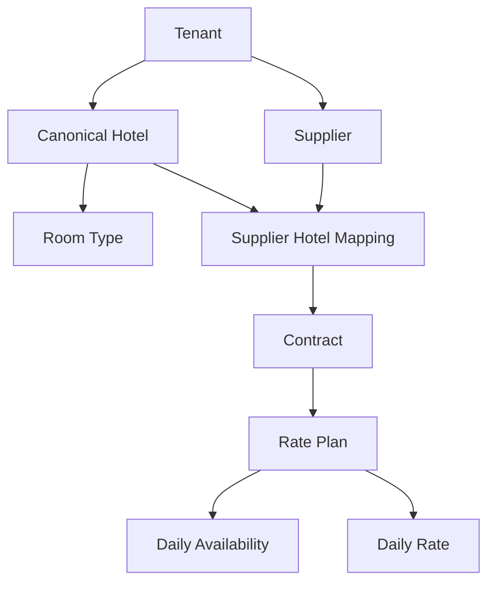

# Supply domain foundation

## Scope

This is the first fBeds supply data foundation. It creates tenant-isolated master, commercial and dated inventory records for a UAE-first platform that can expand to other countries. It does not connect a supplier, ingest live availability, calculate search prices or confirm a booking.

## Migration order

1. `202609190001_supplier_hotel_master`
2. `202609190002_contract_commercial_rules`
3. `202609190003_rate_availability_inventory`
4. `202609190004_connector_registry_foundation`

Historical migrations remain immutable. Each migration is forward-only.

## Domain ownership

`Hotel` is the fBeds canonical property, while `SupplierHotelMapping` holds a supplier's external property identity. This avoids treating a supplier ID as the global hotel identity.

## Lifecycle

Supplier and hotel content are created as draft records. A mapping links supplier content to a canonical hotel. Contracts advance through Draft, Review and Active states; their version is explicit. Active contracts own rate plans; dated availability and rates are maintained separately so later ingestion can be idempotent and bulk-oriented.

All financial amounts are minor-unit `BIGINT`s. Rate calculation, mark-up, public search and booking remain intentionally outside this PR.

## Tenancy and access

Tenant-scoped tables use PostgreSQL RLS through `fbeds_current_tenant_id()` and the existing transaction-local `PrismaService.withTenant()` mechanism. Child records without a direct tenant column (room and policy records) inherit the parent tenant boundary through RLS policy joins. Admin/supplier CRUD endpoints are intentionally not exposed in this foundation.

## UAE-first, multi-country assumptions

Country codes use ISO-3166 alpha-2 values, settlement/rate currencies use uppercase ISO-4217 three-character values, and each hotel records an IANA time zone. UAE records may use `AE`, AED and `Asia/Dubai`; these values are not hard-coded as the only supported market.

## Limitations and next dependencies

- No live supplier adapter, credential creation, webhook, XML or API integration exists.
- No public rate endpoint, search orchestration, recheck, booking confirmation or cancellation workflow is enabled.
- Contract activation workflows and supplier/admin UI require separately reviewed API and UI work.
- Production remains blocked by the release-evidence gates in PR #55.
